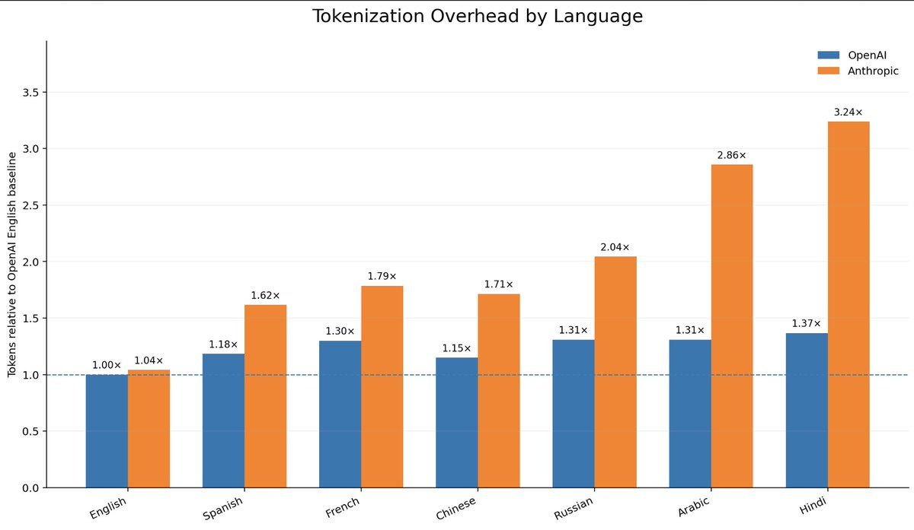

<p align="center">
  
</p>

# Tradukens

Tradukens is a local prompt translator wrapper for coding CLIs. You write a prompt in Spanish, press Enter, and Tradukens sends an English version to the selected agent.

<p align="center">
  
</p>

V1 targets:

- Codex CLI
- Claude Code
- OpenCode

The runtime path is local-only after the one-time setup downloads language models.

## Token impact

Prompt language changes token usage. Tradukens lets you measure the difference with the same local translation pipeline used by the wrapped CLIs:

```bash
tradukens savings "arregla este bug sin cambiar la API pública"
```

The following measurements were generated with `tradukens savings --json` using the `o200k_base` tokenizer. They only count the user prompt, not the rest of the model context.

| Prompt sample | Spanish tokens | English tokens | Tokens saved | Savings |
| --- | ---: | ---: | ---: | ---: |
| Short bugfix prompt | 10 | 7 | 3 | 30.00% |
| Render investigation prompt | 19 | 18 | 1 | 5.26% |
| Validation and tests prompt | 22 | 14 | 8 | 36.36% |
| Long UX/e-commerce prompt | 875 | 748 | 127 | 14.51% |
| **Total** | **926** | **787** | **139** | **15.01%** |

## Install

One-command install for macOS/Linux:

```bash
curl -fsSL https://raw.githubusercontent.com/SergioBanuls/Tradukens/main/install.sh | sh
```

Manual install:

```bash
uv tool install --python 3.12 git+https://github.com/SergioBanuls/Tradukens.git
tradukens setup --lang es
tradukens doctor
```

Development from a local checkout:

```bash
uv sync
uv run tradukens setup --lang es
uv run tradukens doctor
```

## Usage

Translate text:

```bash
tradukens translate "arregla este bug sin cambiar la API pública"
```

Measure token savings:

```bash
tradukens savings "arregla este bug sin cambiar la API pública"
```

Start a wrapped Codex session:

```bash
tradukens codex
```

By default this starts the official Codex TUI inside a pseudo-terminal. Codex still receives your typing while you compose, so its input box, slash commands, and multi-line editing keep their native behavior.
When a normal prompt is submitted, Tradukens intercepts Enter, clears the draft, briefly shows `Traduciendo...`, then replaces the draft with the translated prompt. Press Enter again to send it after review.
Use `Shift+Enter` for Codex's native line break before submitting the prompt.

The older non-interactive wrapper is still available:

```bash
tradukens codex --mode exec
```

Start a wrapped Claude Code session:

```bash
tradukens claude
```

Start a wrapped OpenCode session:

```bash
tradukens opencode
```

When starting `codex`, `claude`, or `opencode`, Tradukens checks the latest GitHub release and prints a short update notice if a newer version is available. To skip this check:

```bash
tradukens codex --no-update-check
```

Check the installation:

```bash
tradukens doctor
```

Inside the REPL:

- Press Enter to translate and send a prompt.
- Use `:paste` for multi-line prompts, ending with `:end`.
- Use `:quit` to exit.
- Lines beginning with `/` are passed through without translation.

## Data

Tradukens stores:

- Config in `~/.config/tradukens/config.toml`
- Models in `~/.local/share/tradukens/models`
- Text-free metrics in `~/.local/state/tradukens/metrics.jsonl`

## Distribution

Run the local release checks before tagging or publishing:

```bash
scripts/release-check.sh
```

Install from a different Git remote with:

```bash
TRADUKENS_REPO_URL=https://github.com/YOUR_USER/Tradukens.git sh install.sh
```

When the package is ready for PyPI:

```bash
uv build
uv publish
uv tool install tradukens
tradukens setup --lang es
```
